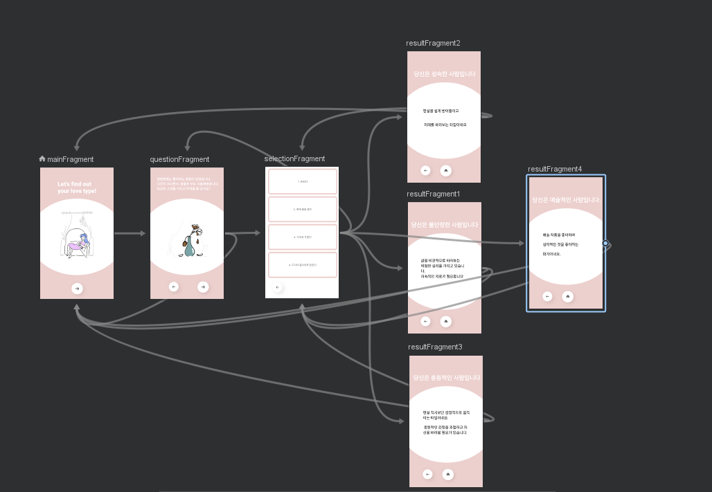
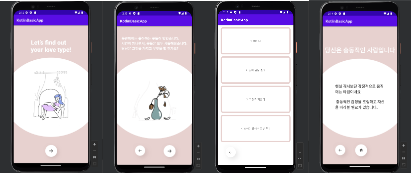

# PsychologistDemo

## Android Jetpack Navigation 
 
> 2023.08.16 - 2023.08.17   

- NavHost 
  1. Fragment 네비게이션을 위한 빈 창. = NavigationHostFragment
- NavController
  1. NavHostFragment는 개별적으로 NavController를 가짐.
  2. 네비게이션 그래프 정보를 이용하여 Fragment 간 action을 담당.
- 탐색그래프(NavGraph) 
  1. Fragment들의 이동을 한 눈에 볼 수 있는 xml.
  2. Navigation Resource file. 

간단한 심리테스트 앱으로 Jetpack Navigation을 통한 Fragment 전환과 Binding 및 Bundle을 통한 데이터 전달 공부.

#### AVD Output

#### 시연 영상
https://youtu.be/7LGNT13y_5U
